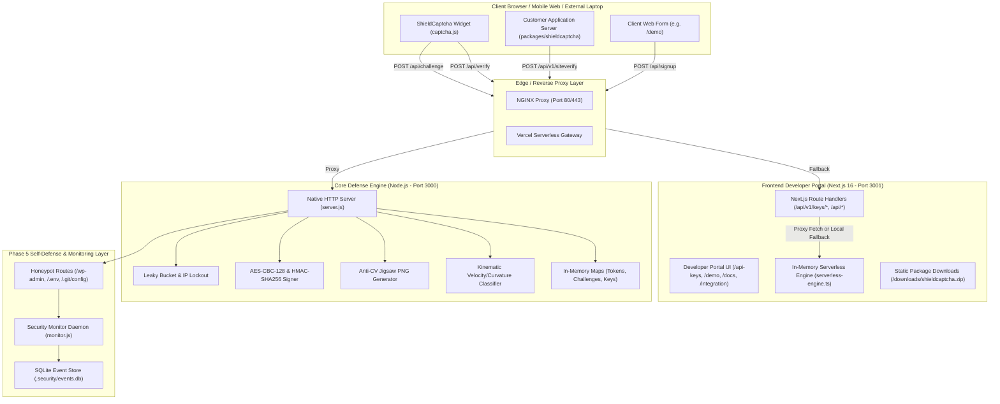

# Project Security Model: ShieldCaptcha Enterprise

## 1. Purpose, User Roles & Core User Journeys

### 1.1 Purpose
ShieldCaptcha Enterprise is an enterprise-grade bot defense and human verification engine. It protects web applications, login forms, and APIs against automated credential stuffing, brute force, content scraping, and bot-driven abuse through dual-layer defenses:
- **1-Click Checkbox Defense**: Transparent Proof-of-Work (PoW) computation, passive client environment auditing, and interaction timing.
- **Anti-Computer-Vision Procedural Jigsaw Slider**: Dynamically generated procedural canvas puzzle pieces with randomized Perlin noise, bezier curve notch geometry, and micro-kinematic mouse trajectory analysis.
- **Multi-Tenant API Key Management**: Customer developers can generate public Site Keys (`pub_shield_...`) and Secret Keys (`sec_shield_...`) to protect their own external applications and websites.
- **Official Client Package & CLI (`shieldcaptcha` v4.2.0)**: Standalone installable Node.js SDK and cross-platform CLI tool allowing any laptop or external system to verify tokens and run local tests.
- **Serverless & Dual-Stack Architecture**: Can run as a standalone zero-dependency Node.js engine (`server.js`), a FastAPI Python service (`captcha_server.py`), or as Next.js 16 serverless edge/lambda routes.

### 1.2 User Roles
| Role | Description | Privilege Level |
| :--- | :--- | :--- |
| **Anonymous Visitor / End-User** | Solves captcha widget to gain access or submit protected forms. | Public / Untrusted |
| **Customer Developer / Client App** | Installs `shieldcaptcha` SDK package, embeds widget, and verifies signed tokens via `/api/v1/siteverify`. | Authenticated via `SITE_SECRET` / API Key |
| **Administrator** | Creates, views, and revokes API keys, monitors threat analytics, and inspects health diagnostics. | Privileged (`ADMIN_SECRET` / Bearer token) |
| **Adversary / Bot** | Attempts automated PoW bypass, trajectory playback, replay attacks, or DoS. | Hostile / Untrusted |

### 1.3 Core User Journeys
1. **End-User Challenge & Verification**:
   - Client widget calls `POST /api/challenge` with desired mode (`checkbox` or `jigsaw`).
   - Server returns challenge metadata (PoW difficulty bits, salt, prefix, procedural puzzle images if jigsaw).
   - Client solves PoW in Web Worker and records mouse kinematics & DOM environment.
   - Client encrypts payload with AES-CBC-128 (PBKDF2-derived key) and submits to `POST /api/verify`.
   - Server audits PoW, kinematics, fingerprint, and honeypots; returns HMAC-signed authorization token on pass.
2. **Server-to-Server Token Verification**:
   - User submits host application form (e.g. login) along with the ShieldCaptcha token.
   - Host application backend sends `POST /api/v1/siteverify` with `token` and `secret`.
   - ShieldCaptcha validates signature, expiration, single-use replay status, and IP binding, returning `{ success: true, score: 95 }`.
3. **API Key Management Journey**:
   - Developer visits `/api-keys` portal -> requests new API keypair via `POST /api/v1/keys/create`.
   - Developer retrieves keys via `GET /api/v1/keys/list` and configures siteKey in frontend and secretKey in backend.
4. **External System / Multi-Laptop Package Journey**:
   - Developer downloads `shieldcaptcha.zip` from website or installs via `npm install shieldcaptcha`.
   - On install or run (`npx shieldcaptcha`), local system specs and connection status are displayed in terminal.
   - Developer configures keys (`npx shieldcaptcha configure --site-key=... --secret-key=...`) and tests connection (`npx shieldcaptcha test`).
   - Developer runs `npx shieldcaptcha demo` to spin up a local verification playground on port 4000.

---

## 2. Technology Stack & Entry Points

- **Core Defense Engine (Backend)**: Node.js (v20+), Zero-dependency standard library (`http`, `crypto`, `fs`, `zlib`, `path`). Entrypoint: [`backend-node/server.js`](file:///c:/Users/Acer/Music/captcha%20system/backend-node/server.js).
- **Alternative Python Backend**: Python 3.10+, FastAPI (`>=0.110.0`), Uvicorn, Pydantic. Entrypoint: [`backend-python/captcha_server.py`](file:///c:/Users/Acer/Music/captcha%20system/backend-python/captcha_server.py).
- **Developer Portal & Showcase (Frontend)**: Next.js 16.3.8 (App Router, Turbopack), React 19.2.8, TypeScript 5, TailwindCSS 4, Framer Motion, Lucide React. Entrypoint: [`frontend/src/app`](file:///c:/Users/Acer/Music/captcha%20system/frontend/src/app).
- **Official Client & Backend SDK**: [`packages/shieldcaptcha/`](file:///c:/Users/Acer/Music/captcha%20system/packages/shieldcaptcha) (`index.js`, `index.d.ts`, `bin/cli.js`, `bin/welcome.js`, `demo/server.js`).
- **Client SDKs**: Standalone Vanilla JS widget bundle [`frontend/public/captcha.js`](file:///c:/Users/Acer/Music/captcha%20system/frontend/public/captcha.js) and [`sdk/captcha.js`](file:///c:/Users/Acer/Music/captcha%20system/sdk/captcha.js).
- **Self-Defense Monitor Layer**: SQLite3 event store (`.security/events.db`), logging daemon (`.security/monitor.js`).
- **Build / Run Commands**:
  - Run Backend Engine: `node backend-node/server.js` (Port 3000)
  - Run Frontend: `npm --prefix frontend run dev` (Port 3001)
  - Production Build: `npm --prefix frontend run build`
  - Run CLI Test: `node packages/shieldcaptcha/bin/cli.js test`
  - Run Security Audit: `node .security/run-audit.js`
  - Run Security Events Monitor: `node .security/monitor.js`
  - Docker Stack: `docker compose up -d --build`

---

## 3. Architecture Diagram

---

## 4. Complete Inventory

### 4.1 Route & Endpoint Inventory

| Endpoint | Method | Component | Auth Required? | Role | Purpose |
| :--- | :--- | :--- | :--- | :--- | :--- |
| `/api/v1/health`, `/health`, `/api/health`, `/api/internal/health` | GET, HEAD | Backend / Frontend | Optional token (`x-health-token` or `?secret=`) | Public (Basic) / Admin (Deep) | System health & operational status |
| `/api/v1/openapi.json`, `/openapi.json` | GET | Backend | No (Hidden unless `EXPOSE_OPENAPI=true`) | Public | OpenAPI 3.0 specification |
| `/api/v1/keys/list`, `/api/keys/list` | GET | Backend / Frontend | Semi-authenticated (Masked secrets by default) | Public / Admin | Lists site keys with masked secret keys |
| `/api/v1/keys/create`, `/api/keys/create` | POST | Backend / Frontend | Configurable (`ADMIN_SECRET` or sandbox mode) | Public / Admin | Creates a new site keypair |
| `/api/v1/keys/revoke`, `/api/keys/revoke` | POST, DELETE | Backend / Frontend | **YES** (`ADMIN_SECRET` or siteKey ownership) | Admin | Revokes an existing site keypair |
| `/api/challenge` | POST, GET | Backend / Frontend | No | Public | Generates PoW challenge, salt, and puzzle images |
| `/api/verify` | POST | Backend / Frontend | No | Public | Decrypts & validates solution; issues signed token |
| `/api/v1/siteverify`, `/api/siteverify` | POST | Backend / Frontend | **YES** (`secret` in body/header or `X-Site-Secret`) | Client Server | Server-to-server single-use token verification |
| `/api/signup`, `/api/login`, `/demo/submit` | POST | Backend / Frontend | **YES** (Requires valid captcha token) | End-User | Demo endpoints demonstrating protected form submission |
| `/api/stats` | GET | Backend / Frontend | No | Public | Global threat mitigation metrics and uptime |
| `/wp-admin`, `/.env`, `/.git/config` | ALL | Backend | No | Honeypot | Security trap routes; immediately triggers 10-min IP ban & logs to SQLite |
| `/downloads/shieldcaptcha.zip`, `/downloads/shieldcaptcha-4.2.0.tgz` | GET | Frontend Static | No | Public | Downloadable client SDK and CLI package |
| Next.js App Pages (12 Pages) | GET | Frontend | No | Public | Developer portal, documentation, simulator, demo, API keys |

### 4.2 Database & Persistence Inventory
- **Application State**: In-memory maps (`challenges`, `usedTokens`, `seenTrails`, `seenNonces`, `ipBuckets`, `ipFails`, `apiKeys`).
- **Security Event Store**: SQLite3 database [`c:\Users\Acer\Music\captcha system\.security\events.db`](file:///c:/Users/Acer/Music/captcha%20system/.security/events.db) storing `security_events` (audit log) and `blocked_ips` (IP blacklist with expiry).

### 4.3 External Outbound API Calls
- **`https://api.indexnow.org/indexnow`**: Called by [`frontend/scripts/indexnow.mjs`](file:///c:/Users/Acer/Music/captcha%20system/frontend/scripts/indexnow.mjs) to submit canonical URLs for indexing.

### 4.4 Environment Variables Inventory
| Variable Name | Default Value / Sensitivity | Used In | Purpose |
| :--- | :--- | :--- | :--- |
| `PORT` | `3000` (Low) | Backend / Docker | HTTP server listening port |
| `FRONTEND_PORT` | `3001` (Low) | Frontend / Docker | Next.js server port |
| `HOST` | `0.0.0.0` (Low) | Backend / Frontend | Interface binding host |
| `NODE_ENV` | `production` / `development` | All | Environment mode |
| `SITE_KEY` | Dynamic or `pub_shield_live_...` | Backend / Frontend | Default public site identifier |
| `SITE_SECRET` | **HIGH SENSITIVITY** | Backend / Frontend | Master server-to-server secret |
| `CAPTCHA_SECRET`| **CRITICAL SENSITIVITY** | Backend / Frontend | HMAC signing key for tokens & salts |
| `ADMIN_SECRET` | **HIGH SENSITIVITY** | Backend | Unlocks key revocation and unmasked secret export |
| `HEALTH_CHECK_SECRET`| **HIGH SENSITIVITY** | Backend / Frontend | Unlocks deep memory & security diagnostics |
| `TRUST_PROXY` | `true` (Medium) | Backend | Controls X-Forwarded-For header trust |
| `ALLOWED_ORIGIN` | `*` (Medium) | Backend | CORS header Access-Control-Allow-Origin |
| `ALLOW_PUBLIC_KEY_GEN` | `true` (Low/Medium) | Backend | Allows sandbox creation of keypairs without admin key |
| `CAPTCHA_BACKEND_URL` | `http://backend:3000` | Frontend | Next.js proxy destination to Node engine |

### 4.5 Background Jobs & Crons
- **In-Memory Cache Garbage Collector**: `setInterval(..., 60000).unref()` in [`backend-node/server.js`](file:///c:/Users/Acer/Music/captcha%20system/backend-node/server.js#L1540).
- **SQLite Event Retention Cleaner**: Daily cleaner purging events older than 90 days.

---

## 5. Trust Boundaries & Data Flow

### 5.1 Untrusted Input Ingestion
1. **Client IP Identification**: Derived from socket address or `X-Forwarded-For` header. Subnet sanitization ensures loopback/private proxies only pass trusted headers.
2. **Encrypted Client Payload**: Submitted via `POST /api/verify`. Decrypted using AES-CBC-128 with challenge session salt. All interior parameters (`nonce`, `trace`, `env`, `interaction`, `honeypot`) undergo strict type checking, bounds validation, and rate-limit auditing.

### 5.2 Sensitive Data Lifecycle
- **Tokens & Secrets**:
  - `CAPTCHA_SECRET`: Kept strictly in server memory; used to generate HMAC-SHA256 signatures for tokens. Never sent to client.
  - `Signed Tokens`: Base64URL-encoded payload + HMAC signature. Contains `sub: ipHash(clientIp)`, `aud: siteKey`, `jti: token_id`, `score`, `exp`. Single-use enforcement ensures tokens cannot be replayed.
  - `API Keys`: `secretKey` is masked on public retrieval (`sec_shield...5b2c`) and only verified server-to-server.

---

## 6. Deployment & Infrastructure

- **Containerization**:
  - [`backend-node/Dockerfile`](file:///c:/Users/Acer/Music/captcha%20system/backend-node/Dockerfile): Node 20-alpine, runs as non-root user `nodejs`, port 3000 exposed.
  - [`frontend/Dockerfile`](file:///c:/Users/Acer/Music/captcha%20system/frontend/Dockerfile): Multi-stage Next.js builder, Node 20-alpine, runs as non-root user `nextjs`, port 3001 exposed.
  - [`docker-compose.yml`](file:///c:/Users/Acer/Music/captcha%20system/docker-compose.yml) & [`docker-compose.prod.yml`](file:///c:/Users/Acer/Music/captcha%20system/docker-compose.prod.yml): Orchestrates Backend + Frontend + NGINX.
- **Serverless Hosting**:
  - [`vercel.json`](file:///c:/Users/Acer/Music/captcha%20system/vercel.json): Configured for Next.js App Router serverless execution on Vercel Edge/Lambdas.

---

## 7. Open Questions & Assumptions

1. **API Key Generation Policy**:
   - *Current State*: `ALLOW_PUBLIC_KEY_GEN=true` allows developers to test generating keypairs from the UI. Revocation strictly requires admin auth.
   - *Question*: For your production deployment, do you want public key generation to remain open (as a self-service sandbox), or restricted strictly to users with an admin secret?
2. **Self-Defense Alert Channels**:
   - *Current State*: Configured for `console + file` (`.security/security.log` and SQLite `.security/events.db`).
   - *Question*: Do you want to configure an external Webhook URL (e.g. Discord, Slack, or Telegram) for real-time critical security alerts when brute force or honeypot triggers occur?
