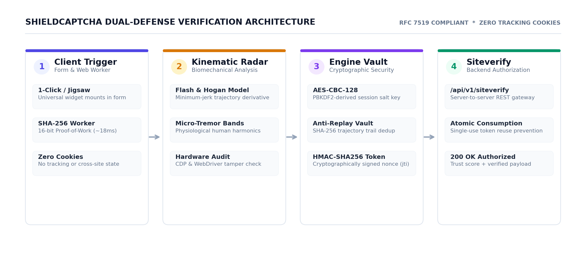

<p align="center">
  
</p>

<h1 align="center">ShieldCaptcha Enterprise</h1>

<p align="center">
  <strong>Self-hostable, zero-cookie human verification and bot defense platform</strong>
</p>

ShieldCaptcha is a self-hostable, zero-cookie human verification and bot defense platform combining client-side Proof-of-Work, biometric kinematics, and cryptographic token verification.

## Table of Contents

- [Key Features](#key-features)
- [Architecture](#architecture)
- [Quick Start](#quick-start)
- [Prerequisites](#prerequisites)
- [Installation](#installation)
- [Configuration](#configuration)
- [Usage](#usage)
- [Project Structure](#project-structure)
- [Development](#development)
- [Deployment](#deployment)
- [Contributing](#contributing)
- [Security](#security)
- [License](#license)

## Key Features

- **Multi-Modal Verification**: Supports 1-Click Proof-of-Work checkbox, interactive jigsaw puzzle slider, and automated risk-based step-up escalation.
- **Client-Side Proof-of-Work**: Computes leading-zero SHA-256 challenges inside a Web Worker without third-party tracking cookies.
- **Biomechanical Kinematics**: Evaluates pointer trajectory derivatives and micro-tremor consistency to detect programmatic automation.
- **Cryptographic Authorization**: Issues single-use HMAC-SHA256 verification tokens with atomic replay protection.
- **Dual Engine Architecture**: Offers a zero-dependency Node.js core backend alongside a synchronized Python FastAPI service.
- **Built-in Developer Portal**: Next.js 16 dashboard providing real-time telemetry, interactive trial sandbox, attack simulator, and API key management.

## Architecture

<p align="center">
  
</p>

ShieldCaptcha operates through an integrated four-stage pipeline:
1. **Client Trigger**: Form mounts the lightweight universal widget and computes a dynamic leading-zero SHA-256 challenge in a background Web Worker.
2. **Kinematic Analysis**: Pointer coordinates, micro-tremor biological harmonics, and browser environment signals are captured and encrypted client-side using AES-CBC-128.
3. **Engine Vault**: The engine decrypts payloads using PBKDF2-derived session keys, validates trajectory physics against anti-replay hashes, and signs an HMAC-SHA256 authorization token.
4. **Siteverify Gateway**: Your application backend calls `/api/v1/siteverify` to atomically consume the single-use token and authorize the request.

## Quick Start

Run the following commands from the repository root:

```bash
npm install
npm run dev:backend
```

In a second terminal, start the Next.js developer portal:

```bash
npm run dev
```

Access the interfaces in your browser:
- Developer Portal: `http://localhost:3001`
- Core Engine API: `http://localhost:3000`

Windows users can also launch both services in a single step using:

```cmd
start-all.bat
```

## Prerequisites

- **Node.js**: `>= 18.18.0` (tested on Node.js v20)
- **npm**: `>= 9.0.0`
- **Python** (optional, for FastAPI backend): `>= 3.10`

## Installation

### 1. Monorepo Setup (Node.js & Next.js)

Clone the repository and install root and frontend dependencies:

```bash
git clone https://github.com/Tusharsinghoffical/ShieldCaptcha.git
cd ShieldCaptcha
npm install
```

### 2. Python Backend Setup (Optional)

If running the Python engine instead of the Node.js core:

```bash
cd backend-python
pip install -r requirements.txt
```

## Configuration

Configure the platform using environment variables. When running locally without variables, default development values are generated automatically.

| Variable | Required | Description | Example Placeholder |
|---|---|---|---|
| `PORT` | No | HTTP port for the Node.js backend (default: `3000`). | `3000` |
| `SITE_KEY` | No | Public site identifier key for client widgets. | `pub_shield_live_example12345678` |
| `SITE_SECRET` | No | Secret key used by application servers to verify tokens. | `sec_shield_live_example12345678` |
| `CAPTCHA_SECRET` | No | Cryptographic HMAC secret for signing verification tokens. | `your-captcha-secret-key-here` |
| `CAPTCHA_BACKEND_URL` | No | Upstream engine URL when proxying from Next.js. | `http://localhost:3000` |
| `HEALTH_CHECK_SECRET` | No | Secret token to unlock deep diagnostic metrics on `/api/health`. | `your-health-secret-key-here` |
| `TRUST_PROXY` | No | Set to `true` when operating behind a reverse proxy (e.g., NGINX). | `true` |

## Usage

### 1. Frontend Integration

Include the standalone client script and mount the widget container in your HTML form:

```html
<form id="login-form">
  <input type="email" name="email" required />
  <div id="captcha-container"></div>
  <button type="submit" id="submit-btn" disabled>Sign In</button>
</form>

<script src="http://localhost:3000/captcha.js"></script>
<script>
  let captchaToken = '';

  ShieldCaptcha.mount(document.getElementById('captcha-container'), {
    mode: 'checkbox',
    onToken: (token) => {
      captchaToken = token;
      document.getElementById('submit-btn').disabled = false;
    },
    onReset: () => {
      captchaToken = '';
      document.getElementById('submit-btn').disabled = true;
    }
  });
</script>
```

### 2. Server-Side Verification

Verify the received single-use token against the verification endpoint:

```bash
curl -X POST http://localhost:3000/api/v1/siteverify \
  -H "Content-Type: application/json" \
  -H "X-Site-Secret: sec_shield_live_example12345678" \
  -d '{"token": "your-verification-token", "ip": "192.0.2.1"}'
```

Response:

```json
{
  "success": true,
  "challenge_ts": "2026-10-04T12:00:00.000Z",
  "score": 95,
  "mode": "checkbox_pow",
  "authorized": true
}
```

Detailed endpoints and parameters are documented in [docs/API_REFERENCE.md](docs/API_REFERENCE.md).

## Project Structure

```
ShieldCaptcha/
├── assets/          # Project visual assets, logo, and architecture diagram
├── backend-node/    # Zero-dependency Node.js HTTP/crypto core defense engine
├── backend-python/  # Synchronized FastAPI Python verification engine
├── docs/            # REST API specifications and integration guides
├── frontend/        # Next.js 16, TypeScript, and Tailwind CSS developer portal
├── sdk/             # Standalone universal client library and embed assets
├── package.json     # Monorepo scripts and workspace configuration
├── start-all.bat    # Windows 1-click master launcher
└── vercel.json      # Production deployment configuration for Vercel
```

## Development

Available scripts defined in `package.json`:

| Command | Action |
|---|---|
| `npm run dev` | Start the Next.js developer portal on `http://localhost:3001` |
| `npm run dev:backend` | Start the Node.js engine with `--watch` on `http://localhost:3000` |
| `npm run build` | Compile the Next.js production bundle |
| `npm run start` | Serve the Next.js production build |
| `npm run start:backend` | Start the Node.js engine in production mode |

To execute the TypeScript build check:

```bash
npm run build
```

To run linter checks on the frontend:

```bash
npm --prefix frontend run lint
```

## Deployment

For full end-to-end production deployment instructions on Linux VPS, AWS, DigitalOcean, Docker, PM2, and Kubernetes, see the comprehensive [docs/DEPLOYMENT_GUIDE.md](docs/DEPLOYMENT_GUIDE.md).

### 1. Docker Compose (Recommended for Any Cloud VPS)

The fastest and most reliable way to run the entire stack on any server:

```bash
# 1. Generate cryptographically secure keys into .env
node scripts/generate-keys.js --write

# 2. Launch production stack in background
docker compose up -d --build

# Alternatively, launch with automated NGINX reverse proxy & SSL:
./scripts/deploy.sh --prod
```

### 2. Linux VPS with PM2 (Bare-Metal / Ubuntu)

To run natively on Ubuntu/Debian using PM2 process supervisor:

```bash
# Install dependencies & compile frontend
npm install
npm run build

# Start services using the preconfigured PM2 ecosystem
pm2 start ecosystem.config.js --env production
pm2 save && pm2 startup
```

*(Systemd service unit definitions are also available in `systemd/`).*

### 3. Vercel (Serverless Edge)

The repository includes [vercel.json](vercel.json) preconfigured for Next.js:

1. Import the repository into Vercel.
2. Keep the root directory as `./` or set to `frontend`.
3. Set `CAPTCHA_BACKEND_URL` to your remote backend engine, or leave empty to use the frontend's built-in serverless fallback engine.
4. Trigger the deployment.

### 4. Health Check & Diagnostics

Verify service availability via the health check endpoint:

```bash
# Basic Health Check
curl http://localhost:3000/api/health

# Extended Diagnostics (Supply your configured secret)
curl "http://localhost:3000/api/health?key=your-health-secret-key-here&deep=true"
```

## Contributing

1. Fork the repository and create a new feature branch (`git checkout -b feature/defense-layer`).
2. Implement your changes and verify that `npm run build` passes with zero errors.
3. Submit a pull request detailing the changes and verification steps.

## Security

Do not report security vulnerabilities through public GitHub issues.

Report security concerns privately to `security@example.com` <!-- TODO: verify security contact email --> with reproducible details.

## License

This project is licensed under the MIT License as declared in [package.json](package.json).
