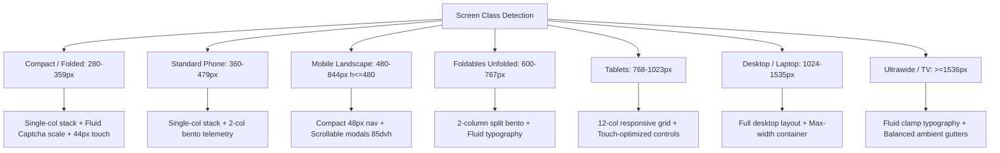
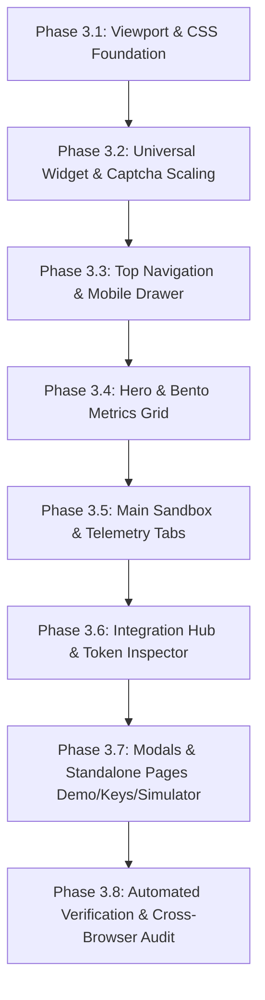

# Phase 2: Responsive, Adaptive & Accessibility Adaptation Plan
**Target Codebase**: ShieldCaptcha Frontend  
**Lead Engineer**: Principal Front-End Engineer & UX/Accessibility Specialist  
**Standards**: WCAG 2.2 AA Compliance, Zero Regressions, 100% Brand Identity Preservation  
**Date**: October 2026  
**Status**: Pending User Approval — Do NOT Proceed to Phase 3 Until User Replies "approved"  

---

## 1. Breakpoint System Definition

Mapped directly to the 7 target device classes without relying on User-Agent sniffing:

| Token Name | Viewport Min | Viewport Max | Target Device Class & Hardware Profiles | Architectural Rationale |
| :--- | :--- | :--- | :--- | :--- |
| **`compact`** | `280px` | `359px` | Galaxy Z Fold (folded cover screen, 280px), iPhone SE 1st gen (320px), ultra-narrow embedded widgets. | Prevents horizontal scroll clipping; fluid scaling of captcha cards; stacks CTAs vertically. |
| **`phone`** | `360px` | `479px` | Standard smartphones: iPhone 13/14/15/16 (390px–393px), Galaxy S23/S24 (360px–412px), Pixel 7/8/9. | Single-column linear flow; 44px touch targets; 2-column balanced telemetry. |
| **`landscape`** | `480px` | `844px` (h: $\le 480$px) | Smartphone landscape orientation (e.g. iPhone horizontal, Galaxy horizontal). | Compact 48px header; modal vertical scroll with `max-h-[85dvh]`; 2-column horizontal side-by-side forms. |
| **`foldable`** | `600px` | `767px` | Unfolded foldables (Galaxy Z Fold unfolded 7.6", Pixel Fold unfolded 7.6", iPad Mini portrait). | 2-column bento grid; dual-pane preview where width allows without full tablet stretch. |
| **`tablet`** | `768px` | `1023px` | iPad (10.2", 11", Air), Surface Pro portrait, Galaxy Tab. | 12-column adaptive grid; hybrid touch/mouse hit areas; persistent visible tabs. |
| **`desktop`** | `1024px` | `1535px` | MacBooks (13", 14", 16"), Windows laptops, 1080p full HD desktop monitors. | Standard 12-column bento layouts; rich hovering tooltips; side-by-side sandbox. |
| **`ultrawide`** | `1536px` | `3840px+` | 1440p QHD, 4K UHD, 34"–49" 21:9 curved ultrawides, TV displays (10-foot UI). | Fluid typography via `clamp()`; max content constraints with balanced ambient gutters; enhanced contrast. |

---

## 2. Fluid Foundation System

### 2.1 Fluid Typography Scale via CSS `clamp()`
To prevent text clipping at 280px and tiny unreadable text on 4K TVs without discrete stepped font jumps:

```css
/* Base Fluid Typography Tokens in globals.css */
:root {
  /* Fluid Hero Title: 32px at 320px viewport -> 60px at 1440px viewport */
  --font-fluid-hero: clamp(2rem, 1.4rem + 3vw, 3.75rem);
  
  /* Fluid Subtitle: 14px at 320px -> 18px at 1440px */
  --font-fluid-sub: clamp(0.875rem, 0.8rem + 0.375vw, 1.125rem);
  
  /* Fluid Section Headers: 20px at 320px -> 30px at 1440px */
  --font-fluid-h2: clamp(1.25rem, 1.05rem + 1vw, 1.875rem);
  
  /* Fluid Body: 13px at 320px -> 15px at 1440px */
  --font-fluid-body: clamp(0.8125rem, 0.775rem + 0.2vw, 0.9375rem);
}
```

### 2.2 Fluid Spacing Scale
Container gutters and component margins scale proportionally:
- Container inline padding: `clamp(1rem, 0.5rem + 2.5vw, 2.5rem)` (16px on mobile $\rightarrow$ 40px on desktop/ultrawide).
- Bento card internal padding: `clamp(0.875rem, 0.6rem + 1.2vw, 1.75rem)` (14px on compact $\rightarrow$ 28px on large screens).

### 2.3 Container Query Strategy
For embedded sub-surfaces (`CaptchaWidget`, `KinematicsOscilloscope`, `AttackSimulator`):
- Declare `@container (max-width: 320px)` on parent wrappers.
- When container width is under 320px, widget uses fluid CSS transform scaling (`transform: scale(calc(100% / 320px))`) to guarantee the 320px security puzzle renders flawlessly with 0px horizontal overflow.

---

## 3. Component-by-Component Adaptation Plan

### 3.1 Top Navigation (`Navbar.tsx`)
- **Current Behavior**: Fixed 64px height; small toggle button; mobile drawer overflows screen without body lock.
- **Target Behavior**:
  - *Compact / Phone*: Sticky 56px height; hamburger button hit-box expanded to $44\times44$px; `aria-expanded` and `aria-controls` bindings; mobile drawer traps focus and locks body scroll; "Demo" button in header scales padding cleanly.
  - *Landscape Phone*: Compact 48px height with reduced padding; drawer scrolls cleanly within remaining viewport height.
  - *Foldable / Tablet*: Smooth transition from mobile drawer to full desktop horizontal links as viewport crosses 768px.
  - *Desktop / Ultrawide*: Full navigation bar centered in `max-w-7xl` with safe padding; active indicators.

### 3.2 Hero Section (`Hero.tsx`)
- **Current Behavior**: 5 metric cards use `grid-cols-2 sm:grid-cols-5`, causing card 5 to span 2 columns and look isolated.
- **Target Behavior**:
  - *Compact ($<360$px)*: Single-column scroll or 2-column compact grid with truncated sub-labels.
  - *Phone ($360$–$639$px)*: 3-column / 2-row adaptive grid or 2-column with card 5 styled as a balanced bottom latency highlight strip.
  - *Foldable & Tablet ($640$–$1023$px)*: Full 5-column balanced row.
  - *Ultrawide ($>1536$px)*: Fluid typography and comfortable spacing.

### 3.3 Universal Captcha Widget (`CaptchaWidget.tsx` & `captcha.js`)
- **Current Behavior**: Canvas and container fixed at $320\times160$px. In $<340$px or 400% zoom, clips or causes 2D scroll.
- **Target Behavior**:
  - *Fluid Scaling*: Container uses `max-width: 100%`. If client container width $< 320$px, dynamically scale via CSS transform matrix or proportional canvas scaling down to 260px without losing touch precision.
  - *Touch Accessibility*: Slider knob target size maintains minimum $44\times44$px touch area.
  - *Keyboard Control*: Arrow Left / Arrow Right steps knob position by 5% with full ARIA slider roles (`role="slider"`, `aria-valuenow`, `aria-valuemin="0"`, `aria-valuemax="100"`).

### 3.4 Interactive Sandbox (`page.tsx`)
- **Current Behavior**: `grid-cols-1 lg:grid-cols-12` (5-col form vs 7-col diagnostics); mode switcher buttons collide on small phones.
- **Target Behavior**:
  - *Compact / Phone*: Form and diagnostics stack cleanly; mode switcher button labels (`1-Click`, `Jigsaw`, `Step-Up`) use responsive padding (`px-1.5 sm:px-2`) and flex shrink.
  - *Diagnostic Tabs*: Tab row uses `overflow-x-auto` with invisible scrollbar and scroll indicators so tabs never wrap into multiple rows.
  - *Audit Stream*: Height adapts using `min(260px, 40vh)` to prevent occupying entire viewport on landscape phones.

### 3.5 Token Inspector (`TokenInspector.tsx`)
- **Current Behavior**: Fixed 4-column claims grid; long HMAC secrets can overflow narrow cards.
- **Target Behavior**:
  - Claims grid adapts: `grid-cols-1 xs:grid-cols-2 sm:grid-cols-2 lg:grid-cols-4`.
  - All token hashes use `break-all font-mono select-all`.
  - Action buttons (`Decode & Verify Token`, `Test Verification API`) expand to full width on mobile (`w-full sm:w-auto`).

### 3.6 Developer Integration Hub (`IntegrationHub.tsx`)
- **Current Behavior**: Language selector pills wrap into 3 jagged rows on narrow phones.
- **Target Behavior**:
  - Selector pills placed inside a smooth horizontal scrolling container (`overflow-x-auto no-scrollbar py-1`).
  - Copy buttons aligned cleanly on their own row or pinned to the card header with $44\times44$px touch targets.
  - Code blocks preserve `overflow-x-auto` with touch momentum scrolling (`-webkit-overflow-scrolling: touch`).

### 3.7 API Keys Management & Modal (`api-keys/page.tsx`)
- **Current Behavior**: Key creation modal has no `max-height` or vertical scroll; in landscape mode, submit buttons are cut off.
- **Target Behavior**:
  - Modal container wrapped with `max-h-[88dvh] flex flex-col`.
  - Header and footer pinned (`shrink-0`); form body scrollable (`overflow-y-auto px-1`).
  - Safe-area insets applied to avoid iOS home bar.
  - Search bar and filter tabs stack gracefully on mobile.

### 3.8 Global Footer (`Footer.tsx`)
- **Current Behavior**: 5-column grid collapses to 1-column on mobile.
- **Target Behavior**:
  - Responsive accordion or 2-column split on standard phones (`grid-cols-2 sm:grid-cols-3 lg:grid-cols-5`).
  - Bottom copyright and policy links stack vertically with clean spacing and $44\times44$px touch targets.

---

## 4. Layout Patterns per Screen Class



---

## 5. Touch & Accessibility Remediation Plan (WCAG 2.2 AA)

1. **Target Size Compliance (WCAG 2.5.8 & 2.5.5)**:
   - Expand all button hit boxes to minimum $44\times44$px using `min-h-[44px]` or pseudo-element hit-area expansion (`relative after:absolute after:-inset-2`).
   - Fix NPM copy button, modal close button, slider refresh button, and tab selectors.
2. **Focus Indicators**:
   - Apply high-contrast dual-layer focus ring (`focus-visible:ring-2 focus-visible:ring-indigo-600 focus-visible:ring-offset-2`).
3. **Reflow & Zoom (WCAG 1.4.10 & 1.4.4)**:
   - Guarantee zero horizontal scrolling at $320$ CSS px equivalent (400% browser zoom).
   - Test all card components at 200% text-only zoom to ensure labels and numbers do not collide.
4. **Safe Area Insets (CSS env)**:
   - Add `:root` safe area tokens in `globals.css`:
     ```css
     --sat: env(safe-area-inset-top, 0px);
     --sar: env(safe-area-inset-right, 0px);
     --sab: env(safe-area-inset-bottom, 0px);
     --sal: env(safe-area-inset-left, 0px);
     ```
   - Apply to sticky navbar, mobile drawers, and fixed dialogs.

---

## 6. Verification Plan & Test Matrix

| Device / Profile | Viewport (CSS px) | DPR | Input Mode | Focus Areas | Verification Steps |
| :--- | :--- | :--- | :--- | :--- | :--- |
| **Galaxy Z Fold (Folded)** | $280 \times 653$ | 3.0 | Touch | Canvas overflow, mode tabs | Test slider drag without horizontal scroll; check button wrapping. |
| **iPhone SE (3rd Gen)** | $375 \times 667$ | 2.0 | Touch | Hero metrics, protected form | Verify 44px touch targets; test PoW checkbox tap. |
| **iPhone 15 / 16 Pro** | $393 \times 852$ | 3.0 | Touch | Dynamic Island, Safe areas | Verify navbar padding with notch; test mobile menu drawer. |
| **Mobile Landscape (Pixel 8)**| $844 \times 390$ | 2.6 | Touch | Modal dialog, header height | Open "Generate Key" modal; verify scroll to submit button. |
| **iPad Air (Portrait)** | $820 \times 1180$ | 2.0 | Touch + Pointer | Sandbox 12-col split, tabs | Test Kinematics Oscilloscope canvas redraw; check tablet layout. |
| **MacBook Air / Laptop** | $1280 \times 800$ | 2.0 | Mouse / Keyboard | Full UI, keyboard navigation | Tab-key traversal across entire page; test keyboard slider. |
| **Ultrawide Monitor** | $2560 \times 1080$ | 1.0 | Mouse | Content containment, readability | Check gutter balance; test fluid typography scaling. |
| **400% Zoom / 320px Reflow** | $320 \times 1000$ | 1.0 | Keyboard | WCAG 1.4.10 compliance | Verify no 2D scrolling anywhere on the page. |

---

## 7. Rollout Order & Dependency Graph



1. **Step 1: Viewport & CSS Foundation**: Update `layout.tsx` (`viewportFit: "cover"`), update `globals.css` (safe area variables, `min-height: 100dvh`, fluid typography tokens).
2. **Step 2: Universal Widget Scaling**: Update `CaptchaWidget.tsx` and `captcha.js` to support fluid container scaling down to 280px with keyboard controls.
3. **Step 3: Top Navigation & Mobile Drawer**: Update `Navbar.tsx` (accessible $44\times44$px toggle, `aria-*` tags, body scroll lock, landscape compact height).
4. **Step 4: Hero & Bento Grid**: Update `Hero.tsx` (adaptive 5-card grid, $44\times44$px copy hit area, fluid header text).
5. **Step 5: Main Sandbox & Telemetry Tabs**: Update `page.tsx` (responsive mode switcher, horizontally scrollable tabs, fluid heights).
6. **Step 6: Integration Hub & Token Inspector**: Update `IntegrationHub.tsx` and `TokenInspector.tsx` (segmented language pills, text wrap).
7. **Step 7: Modals & Standalone Pages**: Update `api-keys/page.tsx`, `demo/page.tsx`, `simulator/page.tsx`, `not-found.tsx` (landscape modal scrolling, button triads).
8. **Step 8: Automated Verification**: Run build (`npm run build`), test across responsive viewports, ensure zero regressions.

---
**Plan Complete**: Awaiting explicit user confirmation before proceeding to Phase 3.
